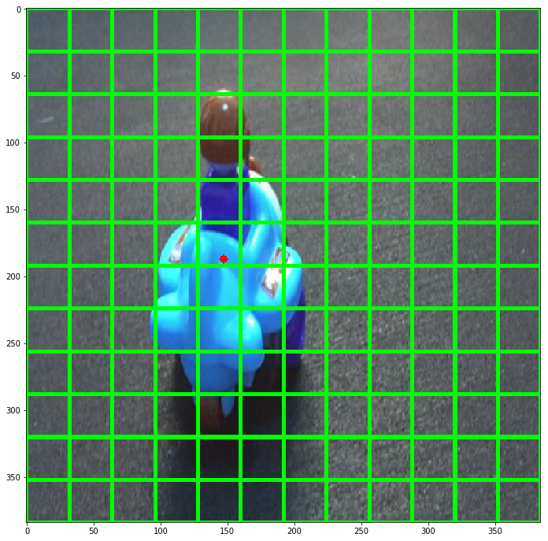
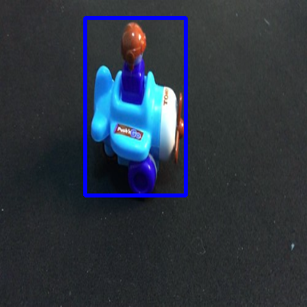
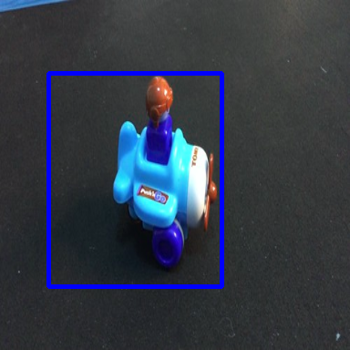

# Yolo_keras_scratch
Implementing tiny yolo from scratch using keras
## Concept Behind yolo
Yolo takes a image and outputs a vector consisting of  [[x,y,w,h,conf],....] where x,y,w,h,conf are between 0-1 i.e normalized.Each image is divided into grid cells like 12x12 , each grid cell predicts 1 or more bbox , conf is the metric whether an object is present in that grid cell or not.In my case , The model takes a input image of shape (384,384,3) and outputs a vector of shape (12,12,2,5) where 12,12 represents grid cells , 2 is the no of bbox each grid cell will predict and 5 is the length of the vector [x,y,w,h,conf]. After training, the model will output multiple bbox for a single object , will use only the bbox with best confidence.  
#### How to make the dataset
LabelImg will give normalized coordinates of a image , x,y,w,h all are normalized with respect to image shape. Now to make true_labels out of these, we will multiply each by image's dimension i.e 384 and for x and y divide by 32 , this will give us the location of grid cell and decimal values will give required coordinates. Look for get_labels() fn for more info.If there is no object in grid cell , [0,0,0,0,0] and for a one with object ,[x,y,w,h,1] . This will help to compute loss b/w predicted labels and true labels. 

## Results

## References
1. for labelling image, use https://github.com/ivangrov/YOLOv3-Series/tree/master/%5Bpart%204%5DOpenLabelling
2. for more depth, https://blog.emmanuelcaradec.com/humble-yolo-implementation-in-keras/
